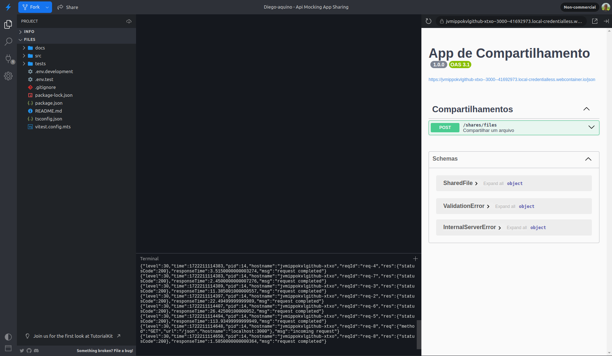
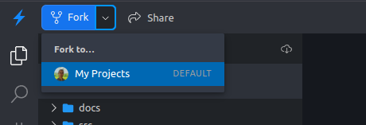
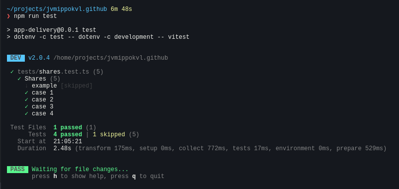
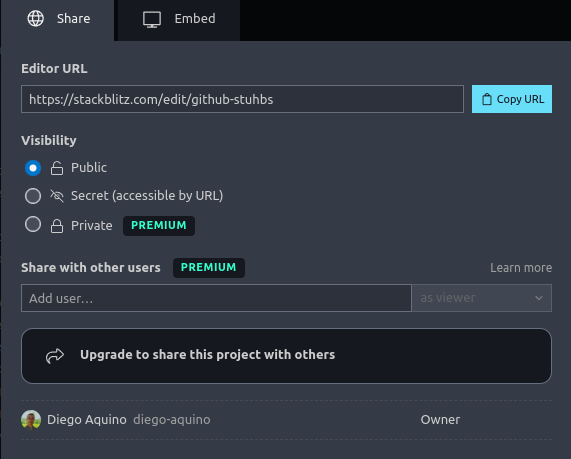

# Sharing System - Applying API Mocks

This is a simplified file sharing platform. It has a route to upload a file,
whose content does not need to be included for simplification. Optionally, the
user can request that the file be converted to another format before sharing. In
this case, the application sends the file to a **conversion API** and waits for
the operation to complete through a polling mechanism (periodic requests at
short intervals). At the end, the application returns a success response to the
user.

## 1. Access

### 1.1. Opening the project in Stackblitz

First, open this project using the following link:

[](https://stackblitz.com/github/diego-aquino/api-mocking-app-sharing?startScript=dev&file=README.md)

This link will open the Stackblitz editor in your browser, similar to
[VS Code](https://code.visualstudio.com), install the dependencies, and start
the server.

On the left side, you will see the project folder structure, followed by an
editor and terminal in the center, and a mini-browser on the right side.



In the upper left corner, click on "Fork" to save the project to your Stackblitz
profile. You will need to log in.



## 2. Project

This is a backend project that uses [Node.js](https://nodejs.org) with
[TypeScript](https://www.typescriptlang.org), [Fastify](https://fastify.dev),
[Axios](https://axios-http.com), and [Vitest](https://vitest.dev).

Important files:

- [`src/server/app.ts`](./src/server/app.ts): main application file where the
  server is implemented.
- [`src/clients/ConversionClient.ts`](./src/clients/ConversionClient.ts): class
  that makes HTTP calls to the conversion API.
- [`tests/shares.test.ts`](./tests/shares.test.ts): file for sharing tests.

Useful commands:

- `npm install`: installs the project **dependencies** (automatically executed
  when opening the project in Stackblitz).
- `npm run dev`: starts the **server** in development mode.
- `npm run test`: runs the **tests** of the application in watch mode.
- `npm run types:check`: checks for **type errors** in the code.

The conversion API URL is declared in the
[`.env.development`](./.env.development) file. It is available in two versions:

| Version | URL                                       |
| ------- | ----------------------------------------- |
| v1      | https://v1-conversion-bd636ba3.vercel.app |
| v2      | https://v2-conversion-bd636ba3.vercel.app |

> [!TIP]
>
> Access the links above to see the documentation for each version of the API.

## 3. Activity

### Part 1: Creating tests

In this first part, we will implement a test suite for this application. You
should use **one** of the two planned API mock tools,
[MSW](https://github.com/mswjs/msw) or
[Zimic](https://github.com/zimicjs/zimic), according to the allocation of your
pair in the Sharing System
[in this spreadsheet](https://docs.google.com/spreadsheets/d/1fOp-6efUEp4KZx8UI9w0EuewHeWP1kIhWzWfViSihW0/edit?usp=sharing).

You should implement **four** test cases in the
[`tests/shares.test.ts`](./tests/shares.test.ts) file. The choice of which
aspects of the application to test is free, considering the following
guidelines:

1. All tests must make at least one request to the application.
2. All tests must exercise behaviors that use calls to the conversion API.
   However, the API should not be accessed directly in your tests, meaning all
   responses should be simulated by mocks.
3. At least one test case must verify a successful response from the application
   (status codes
   [2XX](https://developer.mozilla.org/en-US/docs/Web/HTTP/Status#successful_responses)).
4. At least one test case must verify an error response from the application
   (status codes
   [4XX](https://developer.mozilla.org/en-US/docs/Web/HTTP/Status#client_error_responses)
   or
   [5XX](https://developer.mozilla.org/en-US/docs/Web/HTTP/Status#server_error_responses)).

To run the tests, use the command `npm run test`. With this command running, the
suite will be re-executed automatically when editing the application or tests.



After implementing the cases described above, save the sharing link of the
project. You will need to submit it in the delivery form.



### Part 2: Migration to version 2 of the API

In this second part, we will migrate the project to use version 2 of the
conversion API, which has certain changes compared to version 1.

Before starting, create a copy of the project you used in part 1. To do this,
click the "Fork" button in the upper corner. The goal is to keep the project
from part 1 unchanged and use a copy of it to migrate to version 2 of the API.


In the created copy, you should change the
[`.env.development`](./.env.development) file to use the URL of version 2 of the
API, updating the value of the `CONVERSION_API_URL` variable to the address
below.

`.env.development`:

```bash
CONVERSION_API_URL=https://v2-conversion-bd636ba3.vercel.app
```

If the server or test command is running, you should restart them to read the
new URL.

Between versions 1 and 2 of the API, the following changes occurred:

- The `inputFile.format` field when creating a conversion, which was previously
  optional and inferred from the file extension, is now mandatory;
- In the return of a conversion, the following fields were modified:
  - `inputFileName` and `inputFileFormat` are now part of an `inputFile` object,
    in the properties `inputFile.name` and `inputFile.format`, respectively.
  - `outputFileName` and `outputFileFormat` are now part of a `outputFile`
    object, in the properties `outputFile.name` and `outputFile.format`,
    respectively.

Now, you should adapt the tests and API mocks to handle these changes. To run
the suite, it is naturally necessary to also change the application and
integrate it with the new version of the API. In this activity, refactoring the
application is not mandatory, although it is recommended to check if the tests
are working correctly.

After making the adaptations, save the sharing link of the project used in this
part 2. You will also need to submit it in the delivery form, along with the
link from part 1.

## 4. Delivery

After completing the implementations in this application and in the
[Delivery System](https://github.com/diego-aquino/api-mocking-app-delivery),
fill out the delivery form with the links for parts 1 and 2. Confirm that all
links are publicly visible.

https://forms.gle/FP8gzzaBniawu6EV8
